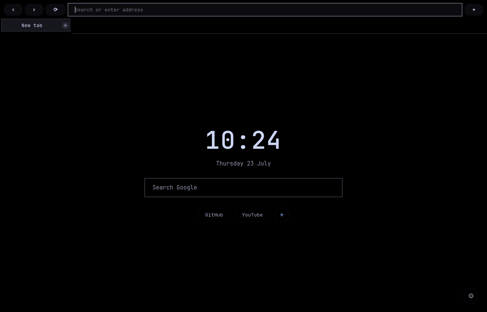
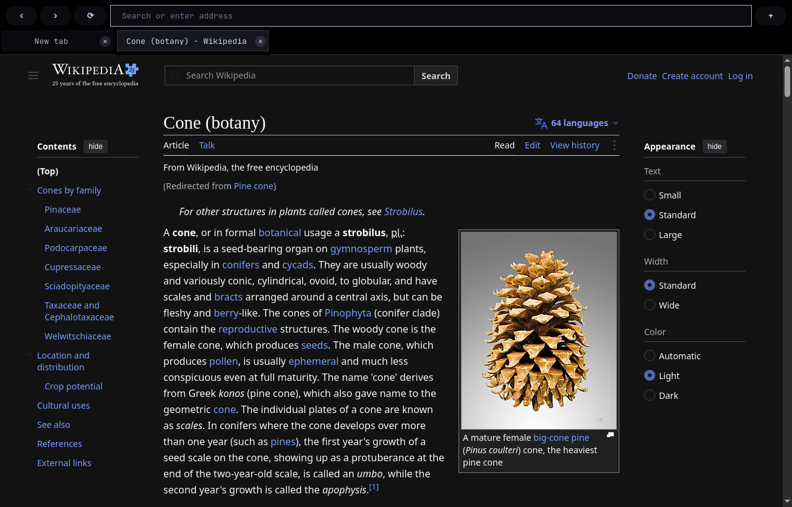
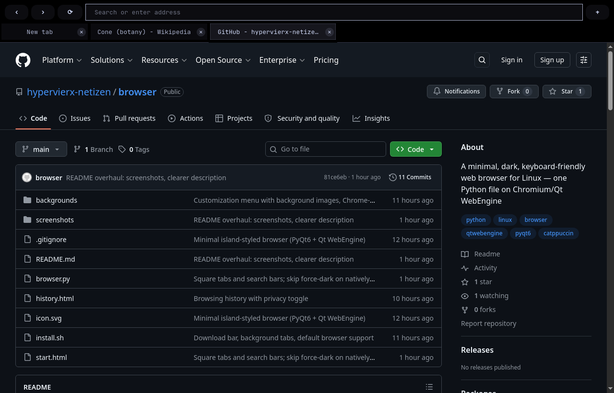

# browser

A minimal, dark, keyboard-friendly web browser for Linux. One Python file,
Chromium rendering (Qt WebEngine), pitch-black with Catppuccin Mocha text
colors — sharp corners, thin outlines, no clutter. Even Google is black.



## Why

Mainstream browsers ship a hundred features you never asked for. This one
does the opposite: tabs, an address bar that searches, downloads, history —
and nothing else. The whole browser is a single readable `browser.py`.

## Features

- **Chromium engine** — real web compatibility, persistent cookies and logins
- **Dark everywhere** — sites with a native dark theme are asked for it;
  light-only sites are darkened automatically (and sites that are already
  dark are left untouched, which keeps heavy sites like GitHub fast)
- **Smart address bar** — URLs, Google search, and live suggestions from
  your visited sites and Google in one field
- **Start page** — clock, search, editable quick links, optional background
  images (bundled photos or your own), and privacy settings
- **Downloads** — bottom bar with progress, speed, time remaining, cancel
- **History** (Ctrl+H) — grouped by day, searchable; can be paused or
  cleared from the start page's privacy panel
- **Single instance** — opening a link from another app lands as a new tab
  in the running window; works as the system default browser
- **Built-in updates** — a Check-for-updates button in the settings panel
  pulls the newest version from this repository
- **Fullscreen video**, background tabs (middle-click), Chrome-style shortcuts

## Screenshots

| Automatic dark mode | Browsing |
|---|---|
|  |  |

*Left: Wikipedia has no dark theme of its own here — the browser darkens it
automatically. Right: GitHub serves its native dark theme.*

## Install

```sh
git clone https://github.com/idkhowtonamemyselfasadev/browser.git
cd browser
./install.sh
```

The install script installs PyQt6 WebEngine through your package manager
(dnf, apt, or pacman; pip as fallback) and registers a desktop entry with icon.

Or just try it without installing:

```sh
python3 browser.py
```

Requirements: Python 3 and PyQt6 WebEngine.

## Keyboard shortcuts

All shortcuts are built into the browser itself — they work the same on any
desktop or window manager, no system configuration needed.

| Key | Action |
|-----|--------|
| Ctrl+T | New tab |
| Ctrl+W | Close tab |
| Ctrl+L | Focus address bar |
| Ctrl+Tab / Ctrl+Shift+Tab | Next / previous tab |
| Ctrl+R / F5 | Reload |
| Ctrl+H | History |
| F11 | Fullscreen |
| Ctrl+Q | Quit |

## Customizing

There is no configuration file — the sources are short and meant to be edited:

| Path | Description |
|------|-------------|
| `browser.py` | Application code. UI colors live in the `STYLE` string; sites that should skip auto-darkening are listed in `NATIVE_DARK_SITES`. |
| `start.html` | Start page. Quick links, backgrounds, and privacy settings are managed on the page itself. |
| `history.html` | History page. |
| `backgrounds/` | Bundled background images. |

The theme is pitch black (#000000) with
[Catppuccin Mocha](https://catppuccin.com/palette/) text colors.
User data (history, settings, cookies) is stored under `~/.local/share/browser/`.

## Windows version

There is a Windows edition at
[idkhowtonamemyselfasadev/browser-windows](https://github.com/idkhowtonamemyselfasadev/browser-windows).

## Uninstall

```sh
rm ~/.local/share/applications/browser.desktop
rm ~/.local/share/icons/hicolor/scalable/apps/browser.svg
```

Browsing data lives in `~/.local/share/browser/` and can be deleted
separately. Remove the cloned repository to complete the uninstall.
