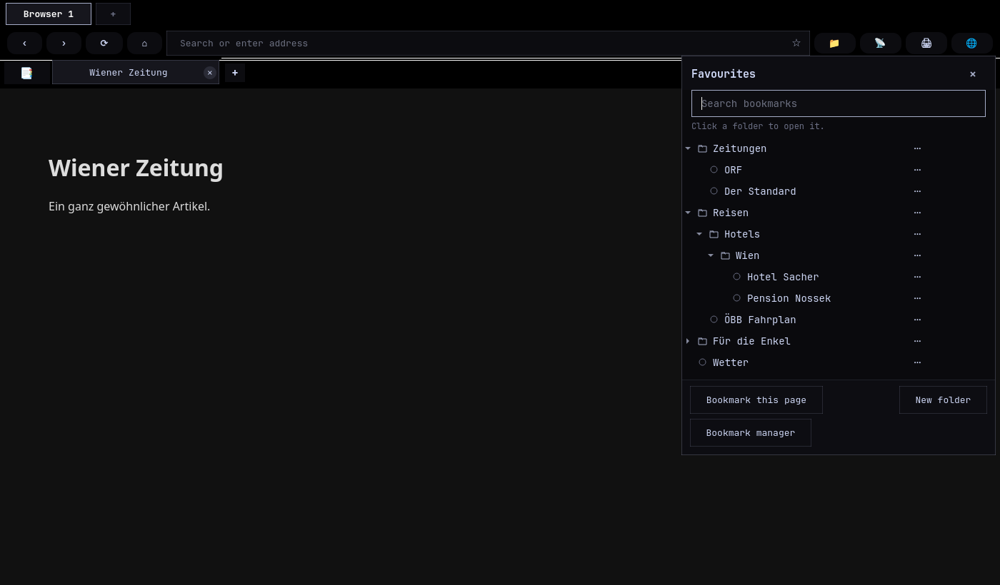
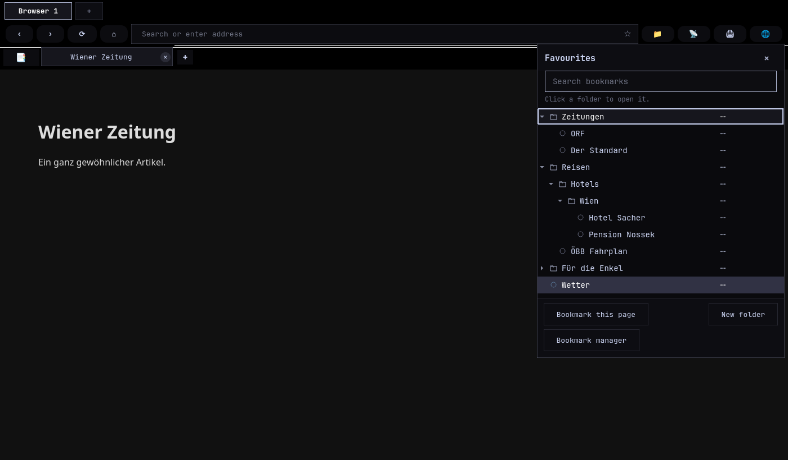

# browser

A dark, keyboard-driven web browser built on Chromium. One readable Python
file, Qt WebEngine underneath, pitch black with Catppuccin Mocha text —
sharp corners, thin outlines, no clutter. Even Google is black.


## Design principles

**Real web compatibility.** Chromium rendering through Qt WebEngine, with
persistent cookies and logins. Sites behave as they do everywhere else.

**Everything in one file.** The whole application is a single `browser.py`
you can read end to end. No build step, no plugin framework, no dependency
tree to audit.

**Dark by default, not by filter.** Sites that ship a dark theme are asked
for it. Light-only sites are darkened automatically. Sites that are already
dark are left alone, which keeps heavy pages fast.

**One palette drives everything.** A theme recolours the window, the tabs,
the menus and every page the browser brings with it — from one table of
colours, applied without a restart. It never touches a website.

**Nothing leaves the machine that you did not ask for.** No telemetry, no
account, no sync. Browsing data stays in `~/.local/share/browser/`.

## Features

### Browsing

- **Tabs and tab groups** — Chrome-style group pills, collapsible, colour-coded
- **Virtual browsers** — several independent sessions in one window, each with
  its own cookie jar and logins; sign in to the same site twice without
  signing out
- **Find in page** (`Ctrl+F`) — match count, next/previous, match case
- **Tab search** (`Ctrl+Shift+A`) — every open tab of every virtual browser in
  one filtered list
- **Reopen closed tab** (`Ctrl+Shift+T`) — restores its position and its group
- **Account chooser** (`Ctrl+Shift+M`, or the `@` in the address bar) — two
  accounts saved for a site means nothing is filled in until you say which
  one. The list of accounts is a panel of the browser's own; the page never
  sees it, and never learns what is on it
- **Private tab** (`Ctrl+Shift+N`) — an off-the-record tab that leaves nothing
  behind: no history, no saved password and none offered, no download record,
  no favicon kept, and no cookies or site storage once the last one closes.
  It is never saved as a tab and never comes back at the next start. Two
  private tabs share one place; a normal tab sees none of it
- **Page zoom from the keyboard** — `Ctrl` `+` / `Ctrl+-` / `Ctrl+0`, and
  `Ctrl`+wheel. Per tab, from 25% to 500%; `Ctrl+0` returns to the level in
  Settings. The browser's own pages are not zoomed a tab at a time — they
  follow the Page zoom slider, the way they always have
- **Favourites** (`Ctrl+Shift+F`, or the folder in the toolbar) — the whole
  bookmark collection in one panel, the way Edge's Favourites button works: a
  search box at the top and one list underneath, folders opening in place
  rather than flying out sideways as submenus. Folders go inside folders as
  deep as you like; a new one is named where you make it, renaming happens in
  the row itself, and every row carries its own `⋯` so nothing is hidden
  behind a right-click. Drag a row into a folder, out of one, or between two
  to reorder it — or use **Move to folder** on the `⋯` if dragging is not
  your friend. The bookmarks bar is off unless you ask for it
  (`Ctrl+Shift+B`); the bookmark manager is `Ctrl+Shift+O`
- **Smart address bar** — URLs, search, and live suggestions in one field
- **Fullscreen video**, background tabs, sleeping tabs restored on demand
- **A toolbar you pick** — right-click the row at the top, or Settings →
  Toolbar, to choose which buttons are up there and what order they come in.
  Back, forward, reload and the address bar stay; everything else is yours,
  and eight more buttons that were only ever keyboard shortcuts can join
  them. Taking a button away never touches its shortcut.

### Downloads and printing

- **Download manager** — a downloads page and a toolbar bar with progress,
  speed and time remaining; pause, resume, cancel; history that survives
  restarts
- **Print or save as PDF** (`Ctrl+P`) — the PDF lands in the downloads list
  alongside everything else

### Privacy and security

- **Vault Password** — the built-in password manager. Optional: setup asks
  whether you want it, and Settings → Plugins switches it on or off at any
  time. Off means off — the login watcher is never put into a page, so no
  form is looked at and nothing is ever written to the vault. Switching it
  off deletes nothing; your saved logins are still there when you switch it
  back on. When it is on it offers to save logins and fills them back in on
  a real click, and the saved password is withheld from page scripts until
  you actually interact with the form, so an injected script reads an empty
  field.
- **Per-site proxy routing** — send chosen sites through a proxy while
  everything else goes direct, or the reverse. Rules are enforced by a
  built-in local proxy and fail closed: a rule pointing at a dead proxy
  blocks the site rather than quietly going direct.
- **Site permissions** — microphone, camera and notification requests are
  asked per origin and remembered per origin, scheme and port.
- **History control** — pause it, search it, or clear it
- **Trust boundary** — the browser's own pages get a privileged bridge to the
  application; websites never do, and cannot reach it through the underlying
  channel

### Setup and configuration

- **Setup** — a seven-step first run: language, search engine, start page,
  site behaviour, privacy, quick links, summary. Re-runnable at any time.
- **Settings** — opens as a pane over the window rather than a page you
  navigate to, so it costs no tab and no history entry
- **Start page** — clock, search, editable quick links, background images
  (bundled or your own)
- **Userscripts** — Greasemonkey-style `*.user.js` files, per profile
- **Themes** — 114 of them (Settings → Theme), grouped Dark / Light / With
  character, searchable, each shown as a swatch of its own colours and
  applied on the spot. Most are credited palettes (Catppuccin, Gruvbox,
  Nord, Dracula, Solarized, Tokyo Night, Everforest, Rosé Pine, Kanagawa,
  Monokai, Ayu, Material, Oxocarbon, Nightfox, GitHub, VS Code…); a few
  bring a face and a texture of their own — Steampunk, Terminal Green,
  Amber CRT, Blueprint, Newspaper, Game Boy. The default is unchanged.
- **Interface translations** — the UI follows the language you choose
- **Single instance** — links from other applications open as tabs in the
  running window; works as the system default browser
- **Built-in updates** — pulls the newest version from this repository

## Screenshots


*Wikipedia has no dark theme of its own — the browser darkens it. A site
that serves its own dark theme is left alone.*

| Favourites | Dragging one in |
|---|---|
|  |  |

*The folder in the toolbar opens the lot. Folders open where they are, the
box at the top narrows the list as you type, and a row dropped on a folder
goes into it — the box says so; a line between two rows would mean the
order instead.*

## Install

```sh
git clone https://github.com/idkhowtonamemyselfasadev/browser.git
cd browser
./install.sh
```

The install script installs PyQt6 WebEngine through your package manager
(dnf, apt or pacman, with pip as a fallback) and registers a desktop entry
with an icon.

To try it without installing:

```sh
python3 browser.py
```

Requirements: Python 3 and PyQt6 WebEngine.

## Keyboard shortcuts

Shortcuts are handled by the browser itself, so they behave the same on any
desktop or window manager with no system configuration.

| Key | Action |
|-----|--------|
| `Ctrl+T` | New tab |
| `Ctrl+Shift+N` | New private tab |
| `Ctrl+W` | Close tab |
| `Ctrl+Shift+T` | Reopen closed tab |
| `Ctrl+L` | Focus address bar |
| `Ctrl+F` | Find in page |
| `Ctrl+P` | Print or save as PDF |
| `Ctrl+Shift+A` | Search open tabs |
| `Ctrl+Tab` / `Ctrl+Shift+Tab` | Next / previous tab |
| `Shift+Tab` | Next virtual browser |
| `Ctrl+R` / `F5` | Reload |
| `Ctrl+H` | History |
| `Ctrl+J` | Downloads |
| `Ctrl+Shift+F` | Favourites — the whole bookmark tree in one panel |
| `Ctrl+Shift+O` | Bookmarks |
| `Ctrl+Shift+P` | Passwords (with Vault Password installed) |
| `Ctrl+Shift+G` | Copy a fresh password to the clipboard |
| `Ctrl+Shift+M` | Choose which saved account signs in here |
| `Ctrl+,` | Settings |
| `Ctrl+` `+` / `Ctrl+-` | Zoom the page in / out (also `Ctrl`+wheel) |
| `Ctrl+0` | Back to the zoom set in Settings |
| `F11` | Fullscreen |
| `F12` / `Ctrl+Shift+I` | Developer tools |
| `Ctrl+Q` | Quit |

Settings, History, Downloads, Bookmarks and Passwords are panes, not
tabs: they open over whatever you were looking at, `Esc` (or pressing
the same key again) closes them, and you are back on the page you came
from. They never appear in the tab strip or the address bar, and they
are never reopened as tabs when the browser starts.

## Configuration

Most settings live in the settings pane (`Ctrl+,`), stored in
`~/.local/share/browser/config.json`. The sources are short and meant to be
edited for anything beyond that:

| Path | Contents |
|------|----------|
| `browser.py` | Application code. Interface colours are in the `STYLE` string; sites that skip auto-darkening are listed in `NATIVE_DARK_SITES`. |
| `start.html` | Start page and first-run setup. |
| `settings.html` | Settings pane. |
| `history.html`, `downloads.html`, `bookmarks.html`, `passwords.html` | The other four panes. |
| `backgrounds/` | Bundled background images. |

The theme is pitch black (`#000000`) with
[Catppuccin Mocha](https://catppuccin.com/palette/) text colours.

User data — history, settings, saved logins, downloads and cookies — is
stored under `~/.local/share/browser/`. Saved passwords are obfuscated with a
per-install key file; the security boundary is your operating system account,
not a master password.

## Security updates

Most of what could go wrong in a browser goes wrong in the engine, and the
engine here is Chromium inside Qt WebEngine. So GitHub keeps an eye on it
for you. Nothing runs on your machine and nothing is sent anywhere.

**On the first of every month** (GitHub cannot say "every five weeks", so
this is the closest it gets) a job runs and asks:

- which Chromium this browser is built on, and how far behind Google's
  current Chrome that is
- whether any Chrome holes *known to be used against people in the wild*
  are newer than that engine — the short list CISA publishes, not the
  thousands of theoretical ones
- whether a newer PyQt6 or PyQt6-WebEngine has been released
- whether the browser's own security checks still pass

**If there is nothing to do, it says nothing.** No issue, no mail. That is
the normal outcome and it is deliberate: a check that pings you every month
is a check you learn to ignore. The full report is always written to the
run's summary page under the repository's Actions tab if you want to read
it anyway.

**If there is something to do, it opens one issue** called "Browser
security check" and keeps editing that same one — it never piles up
duplicates. When the problem is gone it comments and closes the issue by
itself.

### What to do when an issue appears

Read the first section. It is written in the same plain language as this
page and it says which of these it is:

- **"PyQt6-WebEngine x.y.z is out"** — this is the one that matters. Update
  the browser's engine on your machine (`sudo dnf upgrade
  python3-pyqt6-webengine`, or whatever your distribution calls it) and
  merge the Dependabot pull request that bumps the pinned version here.
- **"The browser's own security checks are failing"** — something in a
  recent change broke a protection that was already fixed once. The issue
  names the check. Run `python3 .github/scripts/invariant_checks.py` to see
  it locally.
- **"N Chrome holes known to be exploited are newer than this engine"** —
  worth knowing, usually nothing to install. Qt ships its own Chromium
  snapshot and backports security fixes into it, so it is always a few
  versions behind Chrome by design. Take the next engine update promptly
  and that is the whole answer.

To see which engine your own machine is running:

```sh
python3 -c "from PyQt6.QtWebEngineCore import qWebEngineChromiumVersion as v; print(v())"
```

### The rest of it

**Dependabot** opens a pull request when PyQt6, PyQt6-WebEngine or one of
the workflow actions has a new release. Merging it is the update.

**Every pull request** runs the security checks, so a change that breaks
one cannot merge without a red cross. They also run by hand:

```sh
python3 .github/scripts/invariant_checks.py
```

They start a headless browser against a throwaway profile — your real
history, logins and settings are never touched — and check that a website
cannot reach the browser's internal bridge, that the download and bookmark
controls refuse a page that does not hold this run's key, that a saved
password stays out of the page until a real click, that permissions are
remembered per site *and* port, and that a site routed through a proxy that
is down gets blocked rather than quietly connected.

One catch worth knowing: **GitHub switches scheduled jobs off on a
repository that has had no activity for 60 days**, and mails you when it
does. Any push turns it back on, as does pressing "Run workflow" on the
Actions tab.

## Windows

A Windows edition with the same feature set is maintained at
[idkhowtonamemyselfasadev/browser-windows](https://github.com/idkhowtonamemyselfasadev/browser-windows).

## Uninstall

```sh
rm ~/.local/share/applications/browser.desktop
rm ~/.local/share/icons/hicolor/scalable/apps/browser.svg
```

Browsing data in `~/.local/share/browser/` can be removed separately. Delete
the cloned repository to finish.
